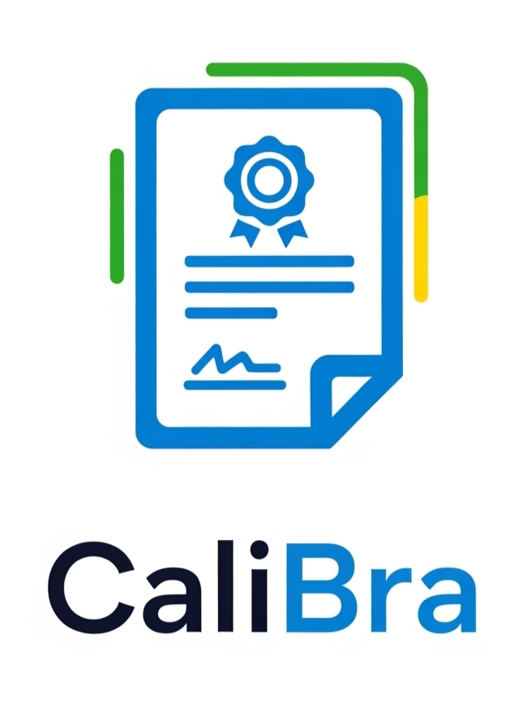

  

# Calibra

## About the Project

Calibra addresses a critical crisis of trust in the multi-billion dollar market of industrial and medical equipment calibration. The current system relies on outdated and easily forgeable paper or PDF certificates, creating significant risks in safety-critical sectors. This leads to a lack of integrity, broken traceability to official standards, and expensive, inefficient audits.

Our solution, **Calibra**, transforms these static documents into live, verifiable digital assets on the blockchain. By minting calibration certificates as NFTs, we create an unbreakable, transparent, and real-time chain of trust.

-   **Integrity & Authenticity**: Certificates are immutable and cannot be faked once minted on the blockchain.
-   **Transparent Traceability**: The entire calibration history of an instrument is recorded on-chain, creating a clear and unbreakable audit trail.
-   **Real-Time Verification powered by Chainlink Functions**: This is what makes our solution alive and truly powerful. We give special emphasis to our use of **Chainlink Functions**, which allow our smart contracts to securely query real-world APIs. This enables us to validate a laboratory's accreditation status *in real-time* before a certificate is ever created, moving the industry from point-in-time trust to continuous, automated verification.

Built on the **Avalanche** network for its scalability and low transaction costs, Calibra provides a robust foundation for a global, federated network of verifiable trust.

---

### ✨ Chainlink Chromion Hackathon Participant ✨

**Calibra is proudly being built and developed as part of the Chainlink Chromion Hackathon.**

Our participation in the hackathon drives our mission to solve real-world problems by bridging on-chain and off-chain data securely. We are leveraging Chainlink's cutting-edge services to bring a new level of integrity to the calibration industry.

---

## Repositories

This project is organized into several repositories. You can find detailed information about each component in its respective repository.

* **[pitch](https://github.com/calibrachain/pitch)**: Contains the project's business plan, vision, and detailed pitch documentation for the hackathon.

* **[calibra-contracts](https://github.com/calibrachain/calibra-contracts)**: Contains all the smart contracts that form the backbone of the Calibra protocol, with a special focus on integration with Chainlink Functions.

* **[calibra-client](https://github.com/calibrachain/calibra-client)**: The frontend application that allows users (auditors, labs, and clients) to interact with the blockchain and manage digital certificates.
  
* **[calibra-laboratories-api](https://github.com/calibrachain/calibra-laboratories-api)**: The API service for accredited laboratories to issue and manage their digital calibration certificates (mocked while don´t exists official APIs).

## Our Team

* [Antonio Quental](https://www.linkedin.com/in/antonioquental/)  
* [Juciley Costa](https://www.linkedin.com/in/juciley-costa/)  
* [Pablo Pereira](https://www.linkedin.com/in/pabloduartepereira/)
* [Thales Santana](https://www.linkedin.com/in/thales-c-santana/)  
